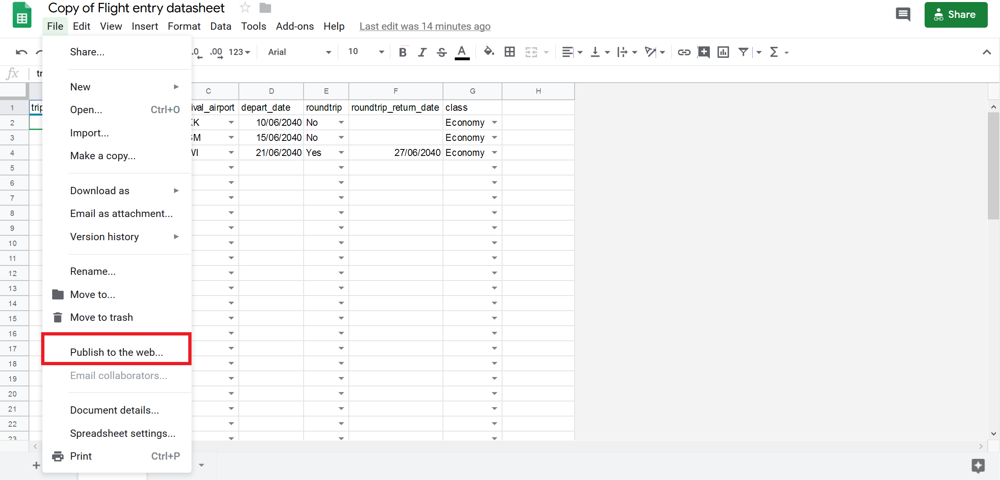

## Project objective:
Help me keep track of carbon emissions due to work-related flying. Method for estimating emissions comes from http://www.flightemissionmap.org/. I'm putting the code and tools online so that you too can visualize your flight emissions!

## This project includes: 
1. Flight tracking data entry tool - view only link:
https://docs.google.com/spreadsheets/d/10_DppOhXNVn38csZiNLH7TJhdyPmqpMO6u3d5zI753A/edit?usp=sharing
  + To make your own copy click this link (Google acount needed): https://docs.google.com/spreadsheets/d/10_DppOhXNVn38csZiNLH7TJhdyPmqpMO6u3d5zI753A/copy

   + I've choosen Google Sheets because it's free and has a mobile app for [iOS](https://itunes.apple.com/app/apple-store/id842849113?mt=8) and [Android](https://play.google.com/store/apps/details?id=com.google.android.apps.docs.editors.sheets) devices (so you can enter data when you're out and about)

2. Ability to create quarterly and yearly visualizations that are dynamic (Shiny web app) and static (png).
- the number of flights
- the estimated amount of emissions in tonne of CO2 equivalent emissions (tCO2e)
  + for caveats of the method, please read the "How are emissions computed?" section on http://www.flightemissionmap.org/

## References:
For contextualizing tCO2 for quarterly visualizations
1. [Ivanova, Diana, et al. "Mapping the carbon footprint of EU regions." Environmental Research Letters 12.5 (2017): 054013.](https://doi.org/10.1088/1748-9326/aa6da9)
2. https://www.climate-transparency.org/g20-climate-performance/g20report2018
3. https://calculator.carbonfootprint.com/ (2013 Honda Civic 4951 miles)
4. [Academic air travel has a limited influence on professional success](https://doi.org/10.1016/j.jclepro.2019.04.109) (Looked at distribution of tCO2 in Figure 3 for creating categories)
5. https://www.linkedin.com/pulse/my-2018-carbon-footprint-tell-me-yours-ed-whiting/
